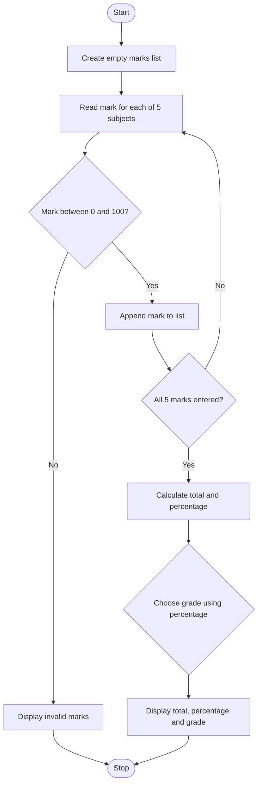

# Flowchart — Student Marks and Grade Calculator

```mermaid
flowchart TD
    A([Start]) --> B[Create empty marks list]
    B --> C[Read mark for each of 5 subjects]
    C --> D{Mark between 0 and 100?}
    D -- No --> E[Display invalid marks]
    E --> F([Stop])
    D -- Yes --> G[Append mark to list]
    G --> H{All 5 marks entered?}
    H -- No --> C
    H -- Yes --> I[Calculate total and percentage]
    I --> J{Choose grade using percentage}
    J --> K[Display total, percentage and grade]
    K --> F
```
